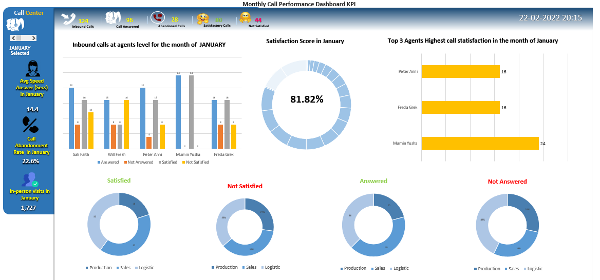

## Call Centre Dashboard
Here’s a how the dashboard looks:

Here are the metrics that you can track using this dashboard:
- **Inbound Calls at Agent level:** To keep track the inbound calls at agent level month wise.I have used SUMPRODUCT() function to plot the bar chart.
- **Top 3 Agents with highest satisfaction score:** This graph depicts the overall performance of the top 3 individual agents by month using a unique key calculation.
- **Answered/Not Answered/Satisfied/Not Satisfied calls:** This is done with the help of donut chart.
- **Satisfaction Score:** This is calculated based on satisfied and not satisfied calls for the individual agents by month. 
